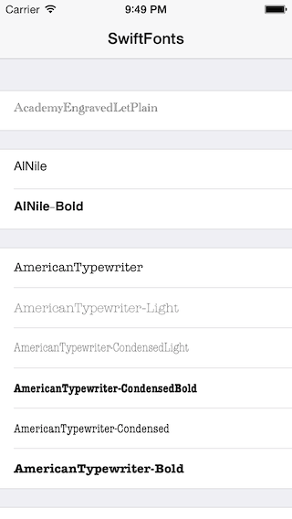

SwiftFonts
==========

An app to list the available fonts on iOS, written entirely in Swift.

## Want to learn more?

If you enjoyed this, you might like our other sample apps, tutorials and articles. Join the mailing list to get more great free stuff: [http://eepurl.com/FSeIT](http://eepurl.com/FSeIT)

## Author

Josh Brown [josh@roadfiresoftware.com](josh@roadfiresoftware.com)
